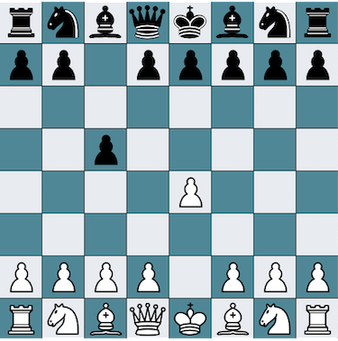

# Chess.Processing
A desktop chess application that uses Processing for the graphics library. The program will only let players make moves that follow the rules of chess, and can detect when there has been check or checkmate.

